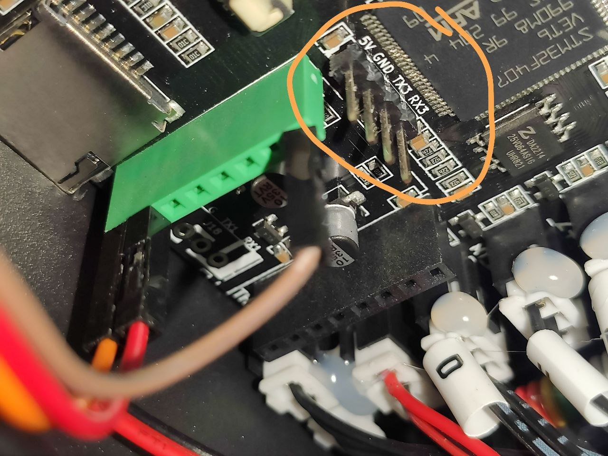
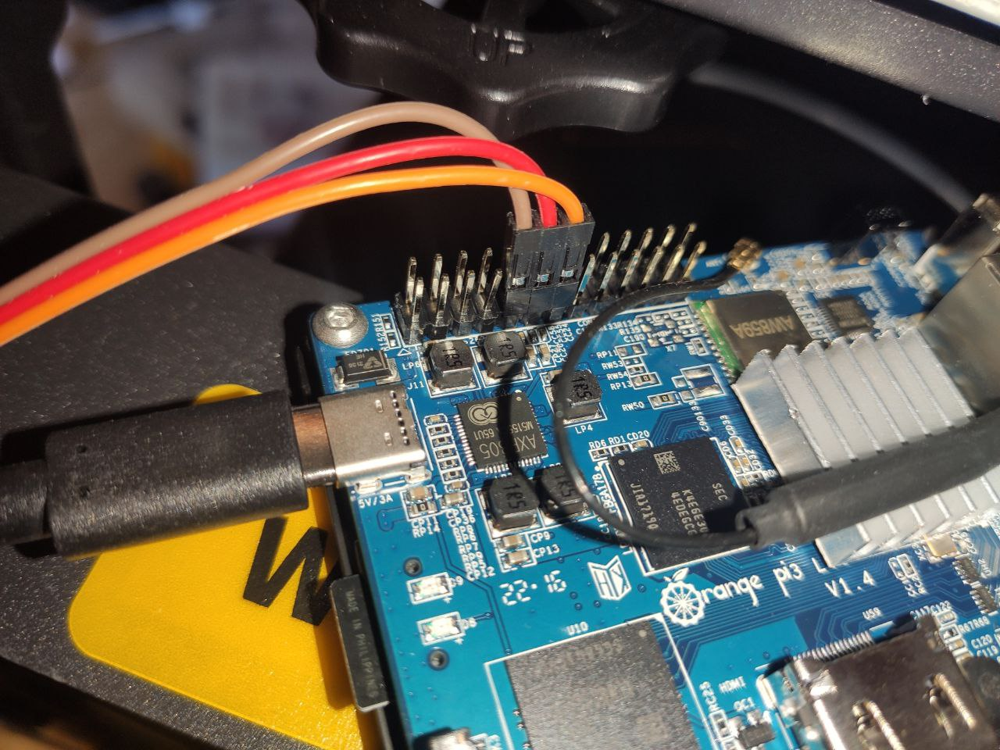
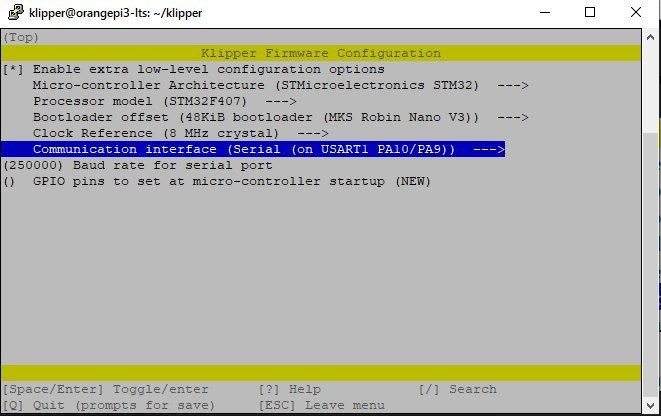
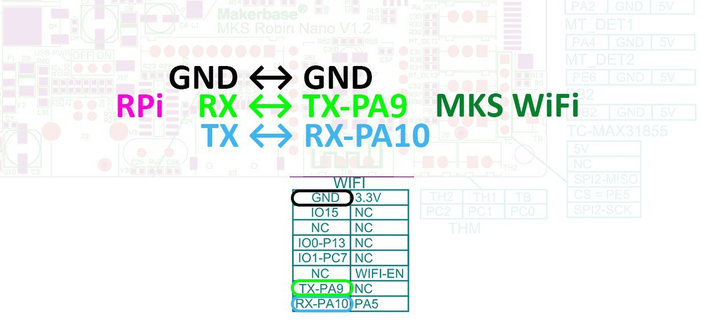

# Всё, что связано с установкой и настройкой Klipper для FB Reborn2

## Установка и настройка Klipper
1. Устанавливаем Klipper любым способом из интернета. Если у вас Raspberry Pi, то подойдёт MainsailOS или Fluiddpi. Также существует KIAUH для установки на обычном компьютере, требуется дистрибутив основанный на Debian, например Ubuntu. Для OrangePi-3 LTS - [образ Armbian](https://redirect.armbian.com/region/EU/orangepi3-lts/Bullseye_current).
Многие устанавливают [по этому гайду на YouTube](https://youtu.be/-0fHoq7IlHA). Есть мнение, что там ошибка в видео, с USART3 нужно собирать P10/11, кто по USB.
Есть еще вот такой [полный видеогайд по установке клиппера (18 роликов)](https://www.youtube.com/watch?v=gfZ9Lbyh8qU&list=PL7zrGeKp_8CRmVTuBaUQcHKlS9bJRU6vT). [И еще один краткий гайд по установке Клиппера](https://t.me/fbg5_waiters/127352).

2. После установки необходимо собрать прошивку со следующими настройками:

для этого выполняем:

`
cd ~/klipper
make clean
make menuconfig
`

После указания настроек выходим из конфигуратора и пишем 

`make`

3. Полученный в результате компиляции файл прошивки находится по пути `~/klipper/out/klipper.bin`. Переименовываем в `Robin_nano_6.bin` и копируем на флешку. Выключаем принтер, вставляем флешку. После включения начнётся обновление. Когда прогресс дойдёт до 100% и будет слышно сигнал, отключаем принтер и удаляем файл с флешки. После этого подключаем провод к компьютеру и включаем принтер. Экран будет гореть чёрным, так и должно быть.

5. Подключаемся к компьютеру к которому подключён принтер по SSH и пишем следующую команду: `ls /dev/serial/by-id/*`. Копируем результат.

4. Заходим в панель управления и загружаем данный [конфиг](printer.cfg) (источник - [https://t.me/fbg5_waiters/143465](https://t.me/fbg5_waiters/143465)). На 82 строчке введите значение из предыдущего пункта. Чтобы получилось так: `serial: /dev/serial/by-id/usb-Klipper_stm32f407xx_4C0041001150475832383220-if00` (у вас другие значения).

5. Сохраните и перезагрузите. Если всё сделано правильно, то нажмите кнопку домика. Принтер должен без ошибок найти свою нулевую координату.

6. Рекомендуется для более точной работы драйверов и возможностью менять их настройки, разобрать принтер и перевести их в режим UART. Инструкция, как это сделать, здесь: [https://t.me/fbg5_waiters/139943](https://t.me/fbg5_waiters/139943).

----

[После момента с установкой клиппера и флуида видео закрывается.](https://t.me/fbg5_waiters/116626) - тут еще много деталей, что делать дальше.

[Как подключать Orange Pi к принтеру (на примере Ghost5?)](https://t.me/fbg5_waiters/116547) и [еще](https://t.me/fbg5_waiters/116593)

[Как настроить timlapse в Клиппере](https://www.youtube.com/watch?v=n-BVPidUDLI&ab_channel=Vez3D)

При подключении по UART на материнской плате используется либо разъем WiFi-модуля, который надо предварительно извлечь, либо отдельный разъем с TX/RX и GND.

Смотри картинку:

Со стороны OrangePi-3 кабель втыкается в гребенку:

Настройки чуть отличаются от настроек для USB:

Вообще, весь процесс описан [здесь](https://klipper.wiki/home/initial/MCU#orange-pi)

И да, необходимо отредактировать файл `/boot/orangepiEnv.txt` или `/boot/armbianEnv.txt` (зависит от установленного дистрибутива). Для этого запускаем редактор от суперпользователя:

`sudo nano /boot/armbianEnv.txt`

находим строчку `overlays=...` и заменям содержимое на `overlays=uart3` (либо, если нет `overlays=` просто дописываем эту строчку в конец файла на отдельной строке).
После этого перезагружаем апельсинку `sudo reboot`.

В конфиге клиппера при таком подключении надо указывать `serial: /dev/ttyS3`.

Еще пара схем с распиновкой разъемов:

